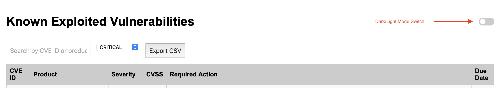

# Vul_Dashboard
# KEV Vulnerability Dashboard

This dashboard visualizes the latest **Known Exploited Vulnerabilities (KEVs)** curated by [CISA](https://www.cisa.gov/known-exploited-vulnerabilities-catalog), enriched with CVSS scores from the [NVD](https://nvd.nist.gov/).

 <!-- optional: add a screenshot -->

---

###  Features

- Live-updating KEV data (`kev_enriched.json`)
- Sortable, filterable table (by CVSS, vendor, due date, etc.)
- Searchable by CVE ID or product name
- Dark mode toggle 
- CSV export option for reporting and analysis

---

###  How It Works

- This dashboard is automatically updated via GitHub Actions
- The `kev_enriched.json` file is pushed from a separate source
- All data is pulled from:
  - [CISA KEV Feed (JSON)](https://www.cisa.gov/sites/default/files/feeds/known_exploited_vulnerabilities.json)
  - [NVD JSON Modified Feed](https://nvd.nist.gov/vuln/data-feeds)

---

###  Viewing the Dashboard

> 💡 If this repo is private, clone it and open `index.html` locally in your browser.  
> Once public and GitHub Pages is enabled, you’ll be able to visit:

https://YOUR_USERNAME.github.io/Vul_Dashboard/

---

###  Project Structure

📦 Vul_Dashboard ┣ 📄 index.html ← Main dashboard UI ┣ 📄 script.js ← Loads and filters JSON ┣ 📄 style.css ← Layout and dark mode ┣ 📄 kev_enriched.json ← Auto-updated CVE data

---

###  Credits

- Data from CISA + NVD
- Dashboard powered by GitHub Actions + static web tech

---

###  Status: In Progress

This dashboard is under active development. Suggestions welcome!
